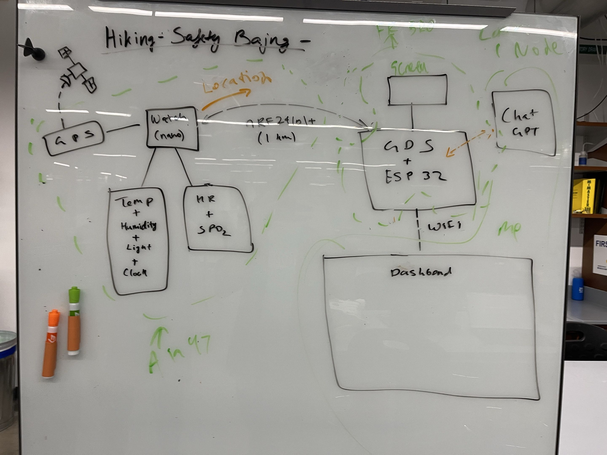
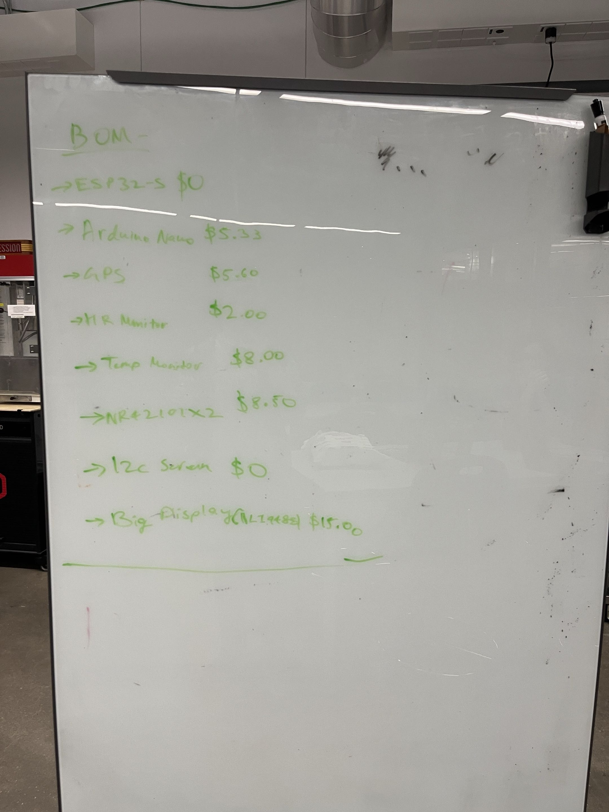
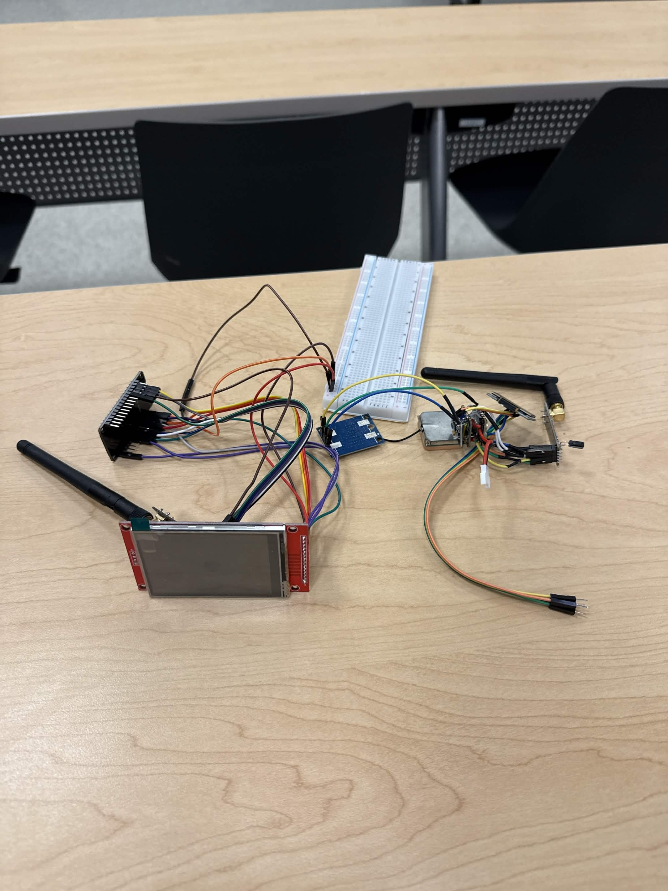

# S.I.G.M.A — Spatial Interactive Geologging Model Application

<p align="center">
  
</p>

> 🏆 **1st Place + Best Design** — IEEE Tech-A-Thon 2026
> Awarded a 3D printer for first overall and a separate Best Design award.

**An offline-first hiking safety system that keeps people alive where cell service can't.**

Hikers wear a sensor-equipped watch that streams vitals and GPS over an nRF24 radio link
to solar-capable ground stations. Ground stations surface contextual, health-aware guidance
on-device, and — when any uplink is available — forward telemetry to a first-responder
dashboard with a live 3D globe, per-hiker cards, and responder-oriented triage views.

The core pipeline works with **zero internet**. Connectivity is an upgrade, not a dependency.

---

## Why this exists

Every year, people go missing in wilderness areas where cell coverage ends at the trailhead.
Existing solutions are either **too expensive** (satellite messengers at $300+ with
subscription fees), **too passive** (paper trip plans, PLB beacons that only fire after
things go wrong), or **too power-hungry** to run unattended in the backcountry.

S.I.G.M.A targets the gap:

- **Proactive, not reactive.** Continuous vitals + GPS every few seconds, not a panic button.
- **Infrastructure-light.** Ground stations are solar-capable ESP32 nodes — drop-and-forget.
- **Offline-first.** The wearable → ground station link is a self-contained nRF24L01+ radio
  path. Internet is only needed for the responder dashboard, and even that degrades
  gracefully.
- **Responder-first UX.** Search-and-rescue teams see a 3D heat map of every hiker's state
  at a glance, with critical alerts surfaced automatically.

---

## System architecture

<p align="center">
  
</p>

This is the clearest single view of the project: the wearable collects telemetry, the
ground station stays useful offline, and the responder dashboard becomes available when an
uplink exists.

The code in this repo implements the telemetry path through the dashboard today. The
optional uplink / API boxes in the diagram reflect the broader system direction, not a
hard dependency for the current demo.

<details>
<summary>Text-only architecture view</summary>

```text
Wearable Watch (ESP32-C6, GPS, vitals, OLED)
  -> nRF24L01+ telemetry
Ground Station (ESP32, OLED, optional solar, local guidance)
  -> WiFi / HTTP when available
Ingest Server (Node / Express)
  -> live feed
Responder Dashboard (React + Three.js)

Offline boundary:
  Wearable <-> Ground Station remains operational without internet.
```

</details>

Full Mermaid source: [`website/sigma-architecture.mmd`](./website/sigma-architecture.mmd).

---

## Design process and artifacts

The assets in [`gitassets/`](./gitassets) tell the story in the order a reader usually
needs it: final system view first, then the sketches and prototype checkpoints that led to it.

### Early concept sketch

<p align="center">
  
</p>

This first whiteboard pass captures the original end-to-end idea: a sensor watch, GPS,
an nRF24 radio hop, a ground-station display, and an optional cloud or AI layer.

### BOM and feasibility planning

<p align="center">
  
</p>

This board is the practical counterpart to the concept sketch: a rough bill of materials
used to keep the hardware stack realistic for a student build.

### Prototype check-in

<p align="center">
  
</p>

This check-in photo shows the system in bring-up mode, with the display, radio hardware,
and sensor wiring assembled on the bench before enclosure work.

### Supporting document

For a longer-form project artifact, see [`gitassets/IEEE-SIGMA.pdf`](./gitassets/IEEE-SIGMA.pdf).

---

## Repository layout

| Path               | What it is                                                                  | Stack                                       |
| ------------------ | --------------------------------------------------------------------------- | ------------------------------------------- |
| [`watch/`](./watch)                 | Wearable firmware — sensors, OLED UI, nRF24 TX                               | Arduino / ESP32-C6 (C++)                    |
| [`groundstation/`](./groundstation) | Ground-station firmware — nRF24 RX, OLED, WiFi uplink                       | Arduino / ESP32 (C++)                       |
| [`server/`](./server)               | Ingest + live-read API between ground stations and dashboard                 | Node.js, Express                            |
| [`website/`](./website)             | Responder dashboard — 3D globe, hiker cards, alerts, settings                | React 19, Vite 8, Three.js, Tailwind v4     |
| [`gitassets/`](./gitassets)         | README media — architecture diagram, sketches, prototype photo, supporting PDF | Images, PDF                                 |

Each sub-project is independently runnable; the end-to-end integration is described below.

---

## Hardware — wearable watch

Target MCU: **Seeed XIAO ESP32-C6**. I²C, UART, and SPI peripherals are split to keep the
radio on its own bus.

| Sensor          | Role                       | Interface        |
| --------------- | -------------------------- | ---------------- |
| NEO-6M          | GPS fix, lat/lon/alt       | UART (GPIO0 RX)  |
| MAX30102        | Heart rate + SpO₂          | I²C `0x57`       |
| SHT40           | Temperature + humidity     | I²C `0x44`       |
| MPU6050         | IMU — shake-to-switch UI   | I²C `0x68`       |
| PCF8563         | Real-time clock            | I²C `0x51`       |
| SSD1306 OLED    | 3 swipeable status screens | I²C `0x3C`       |
| nRF24L01+       | Uplink to ground station   | SPI (CE=D2, CSN=D3) |
| LiPo + divider  | Battery % telemetry        | ADC              |

Firmware entry point: [`watch/FINAL_CODE.ino`](./watch/FINAL_CODE.ino).

Polling strategy is a cooperative loop — sensors are sampled on separate cadences
(5 s env, 30 s battery, 100 ms display, continuous GPS + IMU) so the blocking MAX30102
read never starves the shake detector or radio.

---

## Hardware — ground station

Target MCU: **ESP32** (any dev board with SPI + WiFi).

- **nRF24L01+** receiver pipe matched to the watch's TX address.
- **OLED** shows live vitals, link state, and "NO SIGNAL" fallback when the wearable has
  been silent for >5 s.
- **WiFi uplink** is non-blocking — HTTP POSTs run on a dedicated FreeRTOS task so display
  refresh never stalls on flaky networks. Auto-detects `http://` vs `https://` and picks
  the right client without recompilation.
- **SOS packets bypass rate limiting** and are POSTed immediately.

Firmware entry point: [`groundstation/RX_FINAL_CODE.ino`](./groundstation/RX_FINAL_CODE.ino).
WiFi + server config: copy [`groundstation/WIFI_CONFIG.example.h`](./groundstation/WIFI_CONFIG.example.h)
to `WIFI_CONFIG.h` (gitignored) and fill in SSID, password, and server URL.

---

## Ingest server

A small Express app ([`server/index.js`](./server/index.js)) with two endpoints:

| Endpoint           | Direction                      | Auth              |
| ------------------ | ------------------------------ | ----------------- |
| `POST /api/ingest` | Ground station → server        | `X-Api-Key` header |
| `GET /api/live`    | Dashboard ← server             | open (LAN demo)   |
| `GET /health`      | Liveness + config introspection | open              |

The server intentionally keeps only the latest reading in memory — this is a
situational-awareness system, not an audit log. The dashboard polls `/api/live` and marks
readings **stale** after 30 s so responders never act on ghost data.

### Run it

```bash
cd server
cp .env.example .env.local     # set API_KEY and LIVE_HIKER_ID
npm install
npm run dev
# → Sigma ingest server :3001
```

The server binds explicitly to `0.0.0.0` so the ESP32 on a phone hotspot can reach it
without IPv6-only surprises.

---

## Responder dashboard

A React 19 + Vite 8 app with a Three.js globe at its center.
Entry point: [`website/src/App.jsx`](./website/src/App.jsx).

Key UX decisions:

- **3D globe as the primary surface.** Hikers are plotted as color-coded dots
  (green / amber / red) driven by live threshold logic in [`website/src/lib/hikers.js`](./website/src/lib/hikers.js).
  Status is **derived**, not stored — if thresholds change in Settings, the whole globe
  reclassifies instantly.
- **URL-synced state.** Selected hiker, filters, and view state live in the URL, so a
  responder can paste a link into Slack and drop a teammate directly onto the right view.
- **Critical-alert surfacing.** Rising-edge detection on status transitions triggers
  toast notifications — no polling fatigue, no alert blindness.
- **30 seeded hikers across the US** for demo purposes, with one "live" slot bound to
  the real wearable by `LIVE_HIKER_ID` on the server.

### Run it

```bash
cd website
npm install
npm run dev
# → Vite dev server, usually http://localhost:5173
```

For production: `npm run build` → static bundle in `website/dist/`.

---

## End-to-end demo checklist

1. **Phone:** turn on WiFi hotspot.
2. **Laptop:** join hotspot, run `ipconfig`, note the IPv4 address.
3. **Laptop:** start server — `cd server && npm run dev`.
4. **Laptop:** open port 3001 on Windows Firewall
   (see [`website/context/GROUNDSTATION-HOTSPOT-LAN.md`](./website/context/GROUNDSTATION-HOTSPOT-LAN.md) —
   this step trips up almost every hotspot demo).
5. **Ground station:** flash with `WIFI_CONFIG.h` pointing at `http://<laptop-ip>:3001`.
6. **Wearable:** power on. Serial should show GPS fix + periodic nRF24 transmits.
7. **Ground station serial:** `[uplink] HTTP code=200` within a few seconds.
8. **Laptop:** open `website/` dev server — the live hiker card updates with real vitals.

A full troubleshooting matrix (hotspot client-isolation, IPv6 binds, IP reassignment, etc.)
lives in `website/context/GROUNDSTATION-HOTSPOT-LAN.md`.

---

## Tech stack at a glance

| Layer       | Tech                                                                 |
| ----------- | -------------------------------------------------------------------- |
| Firmware    | Arduino, ESP32 / ESP32-C6, FreeRTOS, nRF24, Adafruit sensor drivers  |
| Transport   | nRF24L01+ (wearable ↔ ground station), HTTP/JSON (ground station ↔ server) |
| Server      | Node.js, Express, dotenv, CORS                                        |
| Frontend    | React 19, Vite 8, React Router 7, Three.js + R3F, Zustand, Tailwind v4, shadcn/ui |
| Dev infra   | ESLint 9, `.env.example` + gitignored real secrets                    |

---

## Design principles we refused to compromise on

1. **Degrade, don't fail.** Every layer has a fallback: no GPS → still transmit vitals;
   no WiFi → ground station still shows on-device guidance; no ingest server → dashboard
   shows stale banner instead of lying.
2. **No secrets in the repo.** `WIFI_CONFIG.h`, `.env.local`, and API keys are gitignored
   with committed `.example` counterparts.
3. **Plain HTTP on a trusted LAN > flaky HTTPS on a constrained client.** The uplink
   code auto-detects and switches, so production can harden this without touching firmware.
4. **Latest reading wins.** The server holds one packet in memory. Situational awareness
   favors freshness over completeness; we're not reconstructing the past, we're acting
   on the present.

---

## Team

A three-person team built S.I.G.M.A end-to-end:

- [Atharv Mungale](https://www.linkedin.com/in/atharv-mungale/)
- [Aryan Kumar](https://www.linkedin.com/in/aryan-kumar-65abb0245/)
- [Felipe Russo Henriques](https://www.linkedin.com/in/felipe-russo-henriques/)

| Role                   | Responsibility                                                                       |
| ---------------------- | ------------------------------------------------------------------------------------ |
| Wearable               | Sensor integration (GPS, HR, SpO₂, temperature, humidity, IMU), nRF24 transmission   |
| Ground station         | ESP32, display, RF reception; CAD enclosures for watch + station                     |
| Dashboard + backend    | 3D globe, heat map, ingest server, alerting and responder UX                         |

---

## Recognition

S.I.G.M.A was built for and presented at the **IEEE Tech-A-Thon 2026**, where it won:

- 🥇 **1st Place Overall** — awarded a 3D printer
- 🎨 **Best Design**

---

## Stretch goals (already scaffolded)

- **Mesh networking** — multi-hop nRF24 routing so ground stations extend each other's range.
- **Consumer "traveler" app** — repurpose the dashboard for trip planning, packing
  reminders, and family location sharing.
- **Voice at the ground station** — microphone + push-to-talk to a responder once the
  hiker reaches a station (radio bandwidth rules out watch-side audio).

---

## Attribution

Project built for the **IEEE Tech-A-Thon 2026**, where it won 1st Place Overall (3D
printer prize) and Best Design. All code in this repository is original work by the team
except for standard Arduino / Adafruit sensor libraries (referenced by `#include`) and the
npm dependencies pinned in each `package.json`.

Licensed under the Apache License 2.0. See [`LICENSE`](./LICENSE).
